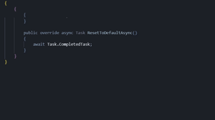
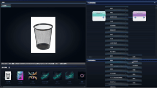
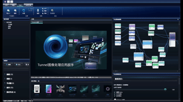
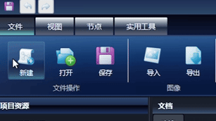

# ✨ Tunnel

    

---

## 简介
Tunnel是一款节点式图像处理应用程序，使用WPF桌面框架。

Tunnel的特色在于高度自由的Tunnel扩展脚本系统，可以不改变主程序同时扩展图像处理功能。
当前的Tunnel处于早期开发阶段，不稳定，不建议用于生成用途。

Tunnel应用程序及源代码按原样提供，不附带任何保证。

## 功能特色

### 扩展脚本系统与节点式处理
受Davinci Resolve、Nuke、Unreal Engine等优秀的业内软件启发，Tunnel选择了*节点式*作为构建处理流程的方法，这有助于实现非破坏性的图像处理，您甚至可以在一个节点后分叉出多个处理路径，并在最后将不同路径的输出融合。尽管当前Tunnel并没有实现撤销等其他图像处理软件的基本功能，得益于节点式流程，这通常不会带来不便。

Tunnel扩展脚本系统以C#语言编写，可以引用所有标准程序集以及主程序包含的程序集。每个Tunnel扩展脚本可以向主程序提供WPF设定面板，拥有自己的MVVM，并且能够使用脚本上下文安全地和主程序交互。

Tunnel扩展脚本最终将以节点形式呈现在主程序中。能够与其他节点相互链接、处理流经的图像或其他数据，并产生输出流向下一个节点。

### Aero GUI

> ***真实、动感、反射、开阔。***

Tunnel由Windows Vista所开创的Aero设计风格所启发，在GUI采用了充足的渐变、高光与玻璃质感。本程序很多渐变模仿自一个古早下载工具"迷你快车"
我们在此采用Expression Design手绘XAML而非交由难以把握Aero设计风格的大语言模型处理，也是本程序Vibe Coding参与最少的部分。光滑而低调的玻璃质感不仅在工作中不会喧宾夺主，还与高质量Aero图标集相得益彰。
.gif)
我们相信：过度的扁平化、Metro化会导致应用程序的GUI失去趣味，正如许多软件从2013至今十几年间，在放弃了拟物化的同时失去了自己的特色，也象征着美妙而丰富的Aero时代远去。
.gif)
如果您在为本项目做出贡献的同时需要新图标，可以自行使用GPT-image-1等模型生成。或者联系项目维护者帮助生成。可生成美丽Aero图标的Prompt会在后续整理后开源。

### 无跨平台性
Tunnel当前只在Windows提供，并且WPF缺乏非商业的跨平台方案。如您有在其他平台运行Tunnel的需求，可借助虚拟机或Wine等工具。Windows-Only固然可能导致用户群体受限，但也为Tunnel提供了轻松的开发流程与高度Vibe Coding适应性。

## 画饼

- 色彩管理
- HDR预览——WPF已有现成的D3DImage与SWAPCHAIN方案
- 曲线编辑器

## 鸣谢

* **OpenCvSharp** – 连接 .NET 与原生 OpenCV
* **Sdcb.LibRaw** – 高性能 RAW 图像解码绑定
* **各种LLM** – 借助大语言模型（ChatGPT、Claude、Gemini）加速开发与文档撰写

## 许可证

Tunnel 采用 **MPL License**，详见 [LICENSE](LICENSE)。各程序集许可证可在应用程序欢迎界面或Licenses文件夹查看。