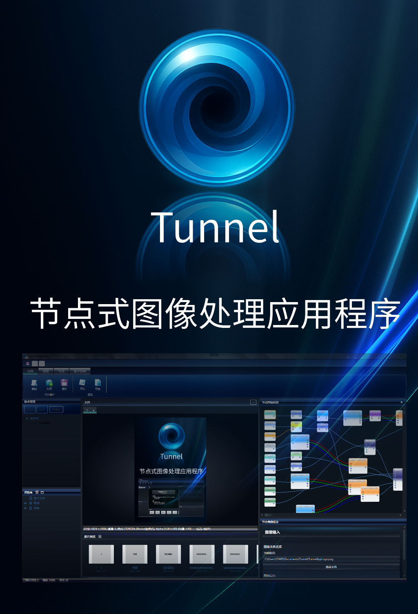

# ✨ Tunnel


[](https://learn.microsoft.com/dotnet) [](https://www.microsoft.com/windows) [](https://opencv.org)  [](LICENSE)

---


Tunnel 是一款拥有 Windows Aero 视觉风格的 **节点式图像处理工具**，通过 C# **Revival Script Framework** 让创意随时「复兴」。拖拽节点、连接端口、实时调参——预览窗口将即时呈现结果。

**核心理念**：

> **会写 `class`，就能造节点！**  
> _无需手动搬 DLL、不用重启 IDE，点击保存，Tunnel 自动为你完成编译与加载。_  
> **相信拟物化的未来**  
> 在 Tunnel，数字界面不只是二维平面——玻璃、光晕与深度可以唤起肌肉记忆。节点图的拖动、连接、滑条都是向现实世界操作的致敬。Aero 玻璃质感让工作区漂浮于光影之间，为创意赋予更直观、更可触的形态。
> 听说某数码大厂最近重新引入了玻璃拟物化，不禁让人感到Aero赢麻。


## ✨ 核心特性

### 节点图编辑器——非破坏性实时创作
受Davinci Resolve和 Unreal Engine「蓝图」的启发，Tunnel 提供直观的节点式工作区。其核心为非破坏性编辑模型：任何操作（如添加节点、连接端口或调整参数）都是对图状结构的更改，而非直接修改源图像。这种图结构将作为 `.tnx` 文件保存，完整保留创作过程。UI 基于 WPF 与 MVVM 模式构建，确保图中的任何变动都能通过 `NodeEditorViewModel` 调度 `ImageProcessor`，即时在预览窗口中重绘输出。这种即时反馈循环鼓励用户无畏永久性修改，自由地进行流畅的实验。


### 脚本系统——代码即节点，保存即重载
脚本系统是 Tunnel 最强大的特性，它能将 C# 代码直接转化为功能节点。只需在 `Scripts` 文件夹中创建 `.cs` 文件，Tunnel 的 `RevivalScriptManager` 就会利用 `FileSystemWatcher` 侦测变动，并通过 Roslyn 编译器自动触发热编译。无需手动编译 DLL 或重启程序，保存代码后数秒内，新的或更新的节点便会出现在菜单中待命。脚本通过 C# 特性（Attribute）定义其 UI，包括名称、分类及参数滑块等。这种「代码即节点」的理念极大加速了自定义工具的开发，让灵感随写随用。


### 元数据系统——让每一帧图像自带上下文
在 Tunnel 中，元数据与像素同等重要。每个节点都能读取和写入元数据，这些信息将随图像数据一同在图中流动。`MetadataManager` 服务为此提供了强大的框架，它能自动合并来自多路输入的元数据，通过记录接触过数据的节点来追踪处理历史，并校验信息完整性。脚本可向管线注入任何自定义数据，如相机设置、色彩配置文件或用户备注，确保每张图像都携带其完整上下文，使复杂流程清晰且易于调试。

### OpenCV 加持——毫秒级像素操控
Tunnel 的图像处理核心构建于 OpenCvSharp 之上，后者作为行业标准 OpenCV 库的 .NET 封装，为所有像素级操作提供了高性能引擎。图像数据以 `Mat` 对象的形式在节点图中流动，允许脚本以接近原生的速度执行复杂的几何变换、滤波和色彩空间转换。`ImageProcessor` 通过拓扑排序和并行处理独立节点，进一步优化了执行效率，确保在处理数百万像素的图像时，用户体验依然流畅、响应迅速。

### 可扩展服务——脚本也能调用系统能力
Tunnel 中的脚本并非孤立存在，它们能通过一个安全的 `IScriptContext` 接口与宿主程序交互。该上下文对象提供了对托管服务的访问，允许脚本请求文件打开对话框、写入临时目录或向用户显示消息框。这种面向服务的架构在保障脚本环境安全的同时，也赋予开发者构建与程序工作流深度集成节点的能力。未来计划通过服务定位器模式（`GetService<T>()`）向脚本创建者开放更多 Tunnel 的内部 API（纯属画饼）。

### Aero 主题——玻璃质感重现 Vista 时代
Tunnel 的用户界面旨在向 Windows Aero 的美学致敬，并为现代工作流进行了重新构想。该主题完全由自定义的 WPF 样式构建，规避了原生依赖，同时抓住了经典设计语言的精髓。通过精选的半透明笔刷、精妙的渐变和圆角，创造出深度感与材质感。利用线性渐变模拟光线在玻璃质感表面的互动，旨在打造一个沉浸式、视觉舒适的环境，让数字化工作空间在长时间创作中更显实体感，不易产生疲劳。


## 🏛️ 架构概览

| 层 | 主要组件 | 职责 |
|---|---|---|
| UI | **Tunnel-Next (WPF)** | 节点图编辑器、Aero 主题、MVVM 工作区 |
| Services | `Tunnel-Next/Services/` | 文档 / 节点 / 连接 / 资源 / 主题管理 |
| Scripting | `Services/Scripting/` | Roslyn 热编译、脚本生命周期管理 |
| 图像处理 | `Services/ImageProcessing/` | OpenCvSharp 封装，高效矩阵运算 |
| 脚本仓库 | `Scripts/` | `.cs` 节点脚本，保存即热加载 |

## 🧑‍💻 编写你的第一个脚本节点

1. 在 `Scripts/自定义/` 创建 `Gray.cs`
2. 粘贴以下模板并保存：

```csharp
using System.Collections.Generic;
using OpenCvSharp;
using Tunnel_Next.Services.Scripting;

[RevivalScript(Name = "灰度", Author = "Demo", Description = "将输入图像转换为灰度", Category = "基础处理", Color = "#95A5A6")]
public class GrayScript : SimpleRevivalScriptBase
{
    public override Dictionary<string, PortDefinition> GetInputPorts() => new()
    {
        ["f32bmp"] = new PortDefinition("f32bmp", false, "输入图像")
    };

    public override Dictionary<string, PortDefinition> GetOutputPorts() => new()
    {
        ["f32bmp"] = new PortDefinition("f32bmp", false, "输出图像")
    };

    public override Dictionary<string, object> Process(Dictionary<string, object> inputs, IScriptContext context)
    {
        if (!inputs.TryGetValue("f32bmp", out var obj) || obj is not Mat src || src.Empty())
        {
            return new() { ["f32bmp"] = new Mat() };
        }

        Mat dst = new();
        Cv2.CvtColor(src, dst, ColorConversionCodes.BGR2GRAY);
        return new() { ["f32bmp"] = dst };
    }
} 
```

3. 回到 Tunnel，节点菜单「基础处理」即会出现 **灰度**，添加到工作区即可使用！

## 💾 工作目录

| 目录 | 作用 |
|---|---|
| `Scripts/` | 你的 `.cs` 节点脚本 |
| `Scripts/compiled/` | Roslyn 生成的 DLL；删除可触发重新编译 |
| `Resources/` | 公共素材 / 控件 |

## 🚀 命令行参数

```powershell
> dotnet run --project Tunnel-Next
```

## 📥 快速开始

### 环境要求

* Windows 10/11（1903 及以上）
* .NET SDK 8.0+

### 克隆并运行

```powershell
# 获取源码
> git clone https://github.com/BEITAware/Tunnel.git
> cd Tunnel

# 构建并启动（Release 模式）
> dotnet build -c Release
> dotnet run --project Tunnel-Next
```

### 目录速查

```text
Tunnel/
├─ Scripts/            # 你的 Revival Scripts（.cs）↩ 自动热加载
├─ Resources/          # 公共图片 / 控件 等资源
├─ Tunnel-Next/        # WPF 主程序源码
│  ├─ Services/        # 核心服务（脚本、I/O、图像处理…）
│  └─ ViewModels/      # MVVM 绑定层
└─ designs/            # Aero 风格设计稿与实验
```

## 🏗️ 规划

- [ ] HDR预览——WPF已有现成的D3DImage与SWAPCHAIN方案
- [ ] 实用工具系统——利用实用工具管理脚本与项目
- [ ] LUT  & 曲线编辑器
- [ ] 公共脚本商店与包管理器（可能在很远的未来）

有新想法？[开个 Issue](https://github.com/BEITAware/Tunnel/issues) 或加入讨论！

## 🙏 鸣谢

* **OpenCvSharp** – 连接 .NET 与原生 OpenCV
* **Sdcb.LibRaw** – 高性能 RAW 图像解码绑定
* **各种LLM** – 借助大语言模型（ChatGPT、Claude、Gemini）加速开发与文档撰写


## 📜 许可证

Tunnel 采用 **MPL License**，详见 [LICENSE](LICENSE)